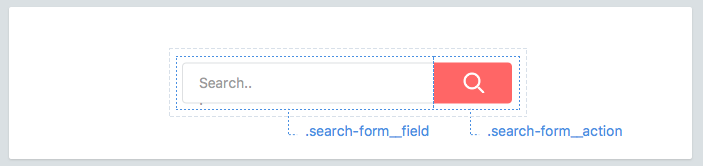

# Elements

Elements are things inside your component.



## Naming elements
Each component may have elements. They should have classes that are only **one word**.

```scss
.search-form {
  &__field { /* ... */ }
  &__action { /* ... */ }
}
```

## Element selectors
We prefer not to nest classnames unless you are nesting modules. We also do not use child selectors because of refactoring issues.

```scss
.article-card {
  .title     { /* ✗ avoid */ }
  &__title { /* ✓ better */ }
  > .author  { /* ✗ avoid */ }
}
```

## On multiple words
For those that need two or more words, concatenate them with dashes.

```scss
.profile-box {
  &__first-name { /* ... */ }
  &__last-name { /* ... */ }
  &__avatar { /* ... */ }
}
```

## Avoid tag selectors
Use classnames whenever possible. Tag selectors are only acceptable when styling WYSIWYG output.

```scss
.article-card {
  > h3    { /* ✗ avoid */ }
  &__name { /* ✓ better */ }
}
```

Not all elements should always look the same. Modifiers can help.
[Continue →](modifiers.md)
<!-- {p:.pull-box} -->
